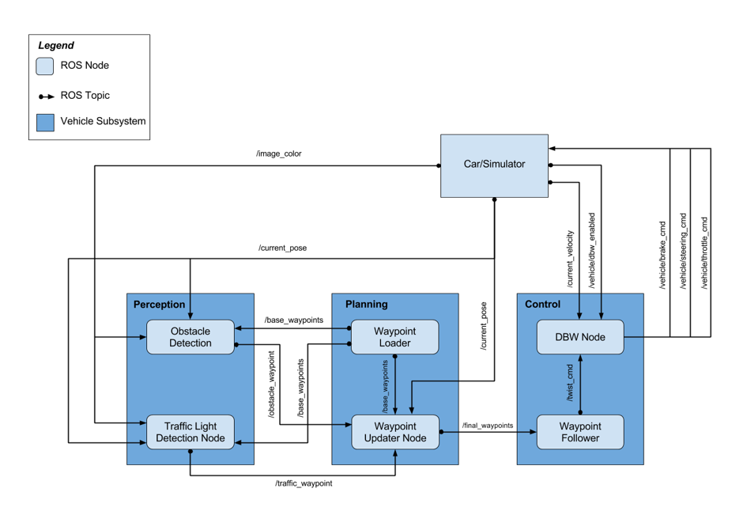

# SDC-SystemIntegration
My own Project from SDC Udacity Course (Project 8). This project integrates self-driving-car functions using ROS.
The car drives autonomous following certain path. If the traffic light change to RED it stops.

<p float="left">

</p>

## Parts
1. *waypoint_updater/waypoint_updater.py* --> creates a ROS Node, which subscribe to base waypoints and traffic light state, and publish the following waypoints in certain horizont.
2. *twist_controller/twist_controller.py* --> implements vehicle control
3. *twist_controller/dbw_node.py*  --> creates a ROS Node, which subscribe to desired velocity, manual control or lane change, 
and uses twist_controller.py to control the car, by publishing throttle, steering and brake 
4. *tl_detector/tl_detector.py*  --> creates a ROS Node, which subscribe to base waypoints, current position. If traffic light state is RED and using the position of the car,
it publishes where the car should stop.

## How to run project
1. get complete Project from https://github.com/udacity/CarND-Capstone
2. exchange /ros folder for this one
3. run on a terminal
```
cd CarND-Capstone/ros
catkin_make
source devel/setup.bash
roslaunch launch/styx.launch
```
4. load the simulator and deactivate manual and activate camera

## More
I attached also a short video of car driving by itself!
